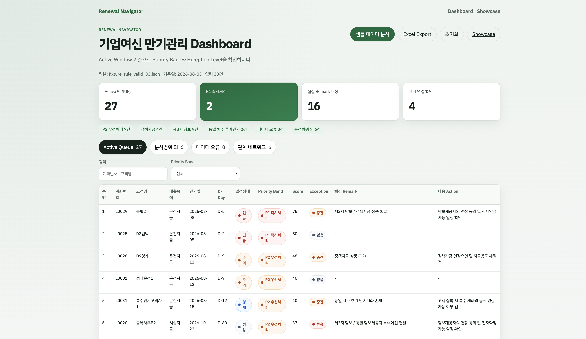
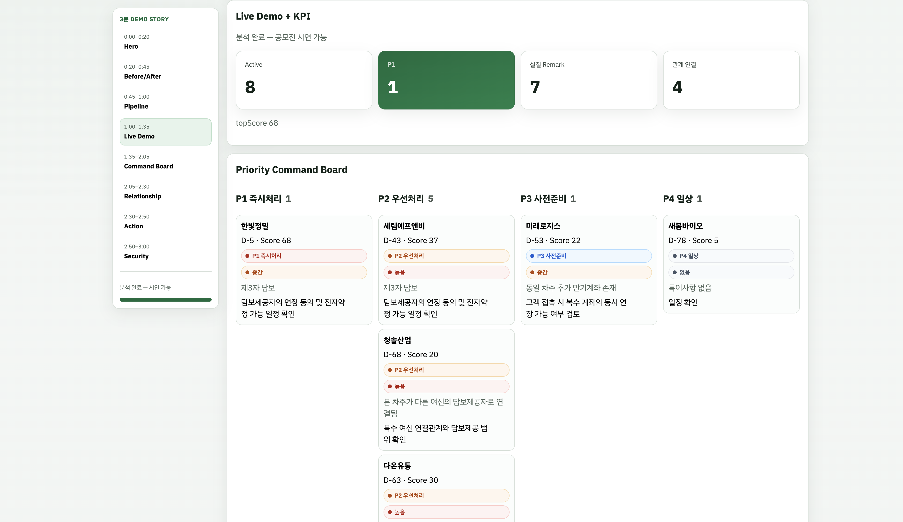
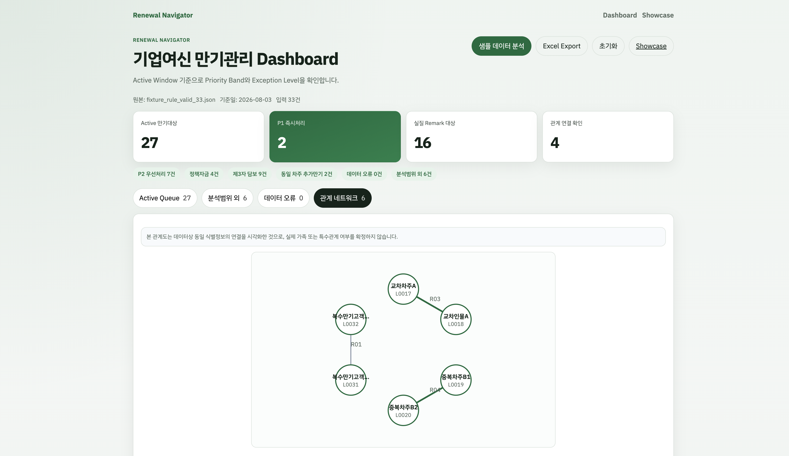
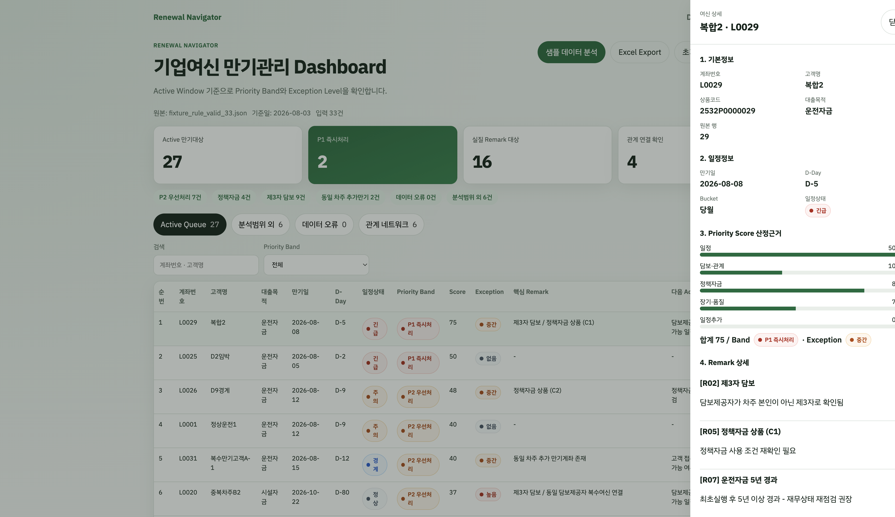

# Renewal Navigator (기한연장 도우미)

기업여신 만기관리 의사결정 지원 AI Agent — **브라우저 단독** 웹앱.

RAW 엑셀(또는 샘플 Fixture) → V01~V05 검증 → R01~R08 + S01 → Active Window 기준 Priority Band / Exception Level / Action / 종합의견.

서버·DB·로그인·영속 저장(`localStorage` 등) 없음. **MIT License**.

| 항목 | 내용 |
|---|---|
| 버전 | **1.0.0** (공모전 제출본) |
| Truth | `docs/reference/rule_engine_v2_1_reference.py` |
| 기준 문서 | `docs/PRD_v2.1_Final_*.md` · `Architecture.md` · `docs/SUBMISSION.md` |
| Fixture | `fixture_rule_valid_33` · `fixture_boundary_invalid` · `fixture_showcase` |
| 스택 | Vite · React 19 · TypeScript (strict) · Vitest · React Router · SheetJS |
| 배포 | **https://renewal-navigator.vercel.app** · GitHub `yeob90-bit/kb-new-project` |

---

## 스크린샷

| Dashboard | Showcase |
|---|---|
|  |  |

| 관계 네트워크 | 계좌 Drawer |
|---|---|
|  |  |

---

## 빠른 시작

```bash
npm install
npm run dev          # http://localhost:5173 → /dashboard
npm run qa           # typecheck + test + build
npm run preview      # 프로덕션 미리보기 :4173
```

| 경로 | 용도 |
|---|---|
| `/dashboard` | RM 실무: 샘플 분석 · KPI · 4탭 · Drawer · xlsx Export |
| `/showcase` | **공모전 3분 시연** (fixture_showcase 전용) |

---

## Vercel 배포

**Live Demo:** [https://renewal-navigator.vercel.app](https://renewal-navigator.vercel.app)

| 경로 | URL |
|---|---|
| Dashboard | https://renewal-navigator.vercel.app/dashboard |
| Showcase (3분 시연) | https://renewal-navigator.vercel.app/showcase |

재배포:

```bash
bash scripts/run_vercel_deploy.sh
```

- Framework: Vite · Output: `dist` · SPA: 모든 경로 → `index.html`
- 상세: [`docs/SUBMISSION.md`](docs/SUBMISSION.md)

---

## 공모전 제출본 생성

```bash
npm run pack:submission
# → submission/RenewalNavigator_공모전제출본_YYYYMMDD.zip
```

포함: README · LICENSE · Build(`dist`) · 소스 · 테스트 · PRD · Reference · ScreenShot 4종 · `vercel.json`

---

## Sprint12 최종 검증 (Reference 전수 패리티)

| Case | 기준일 | 앵커 |
|---|---|---|
| `fixture_rule_valid_33` | 2026-08-03 | Active **27** · P1 **2** · realRemark **16** · topScore **75** |
| `fixture_boundary_invalid` Group A | 2026-08-03 | 계좌 단위 전수 ≡ Reference |
| B12 only | 2026-11-20 | `TWO_MONTHS_LATER` · dDay **56** · score **5** |
| `fixture_showcase` | 2026-08-03 | Active **8** · P1 **1** · realRemark **7** · topScore **68** |

```bash
python3 scripts/regenerate_ref_parity.py   # golden 재생성
npm test && npm run build
```

검증 결과: **차이 0건**.

---

## 엔진 파이프라인

```text
RawRow → validateLoans(V01~V05) → evaluateBusinessRules(R01~R08)
      → assemble (Bucket / D-Day / Score / Band / Exception) → AnalysisSummary
```

- Active Window만 `priorityScore` / `priorityBand` (밖은 `null`)
- Remark R02~R08은 Bucket 무관 · R01만 Active Window 내
- Exception Level은 Remark 기준 (Bucket 무관)

---

## 스크립트

| 명령 | 설명 |
|---|---|
| `npm run dev` | 개발 서버 |
| `npm run build` | 프로덕션 빌드 |
| `npm run qa` | typecheck → test → build |
| `npm run pack:submission` | 공모전 zip 생성 |
| `npm test` | Acceptance (Reference 패리티 포함) |

---

## Export · 보안

- Export: 신규 Workbook 7시트 — `기업여신_만기관리_분석결과_{기준일}.xlsx`
- 전화·자동이체모계좌·보증인 연락처류 미매핑
- `localStorage` / `sessionStorage` / `IndexedDB` 금지

---

## 폴더 요약

```text
docs/                 PRD · Reference · SUBMISSION · screenshots
src/entities/loan/    검증·Rule·Schedule·Score·runAnalysis
src/features/         sample-load · showcase-load · excel-export
src/pages/            dashboard · showcase
tests/                Acceptance · golden parity
submission/           공모전 zip 출력
LICENSE               MIT
vercel.json           SPA 배포 설정
```
